  

### whoami

I build AI systems and ship them as products: vision-language models, LLM pipelines, and the guardrails that keep them honest.

- 🔭 Currently: taking generative AI products from prototype to production
- 🧪 Research interest: why VLMs hallucinate, and how retrieval helps
- 🛠️ Toolbox: Python, TypeScript, PyTorch, FastAPI, RAG, MCP
- ☕ Fuel: coffee and late nights

### Where my skills live

  

### Featured projects

| Project | What it does |
|---|---|
| [vlm-hallucination-rag-evaluation](https://github.com/jimmy20020528/vlm-hallucination-rag-evaluation) | Measures VLM hallucination and how much RAG reduces it |
| [enron-email-pipeline](https://github.com/jimmy20020528/enron-email-pipeline) | AI-assisted extraction, deduplication and MCP notifications over the Enron dataset |
| [conversational-emotion-trajectory-mvp](https://github.com/jimmy20020528/conversational-emotion-trajectory-mvp) | Utterance-level emotion and conversation trajectories, with a Streamlit demo |
| [furniture-curation](https://github.com/jimmy20020528/furniture-curation) | Tagging tool for a 3D furniture library that feeds an auto-layout solver |

### Contributions, but make it arcade

<picture>
  <source media="(prefers-color-scheme: dark)" srcset="https://raw.githubusercontent.com/jimmy20020528/jimmy20020528/output/pacman-contribution-graph-dark.svg">
  <source media="(prefers-color-scheme: light)" srcset="https://raw.githubusercontent.com/jimmy20020528/jimmy20020528/output/pacman-contribution-graph.svg">
  
</picture>
